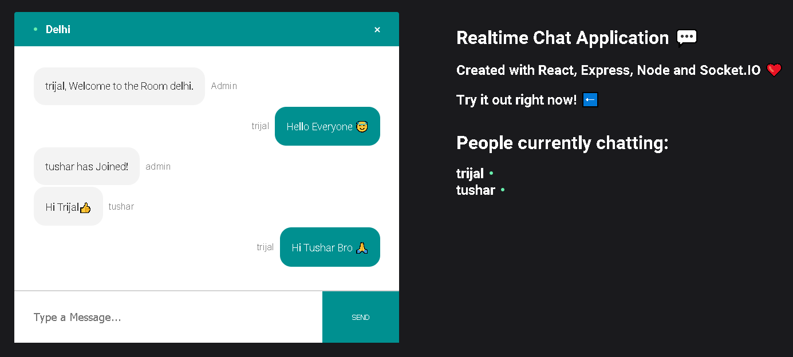

# CoviCure Real-Time Chat Application

### [Live Site](https://60df10a4c5f3c1dcbcb16a8a--covicure-chat-application.netlify.app/)

<<<<<<< HEAD

=======

>>>>>>> 1cddfb50168eaa84fa2069a4ae4efbaae967032d

## Tech Stack Used:
*Front-End: Reactjs, HTML, CSS, JS*<br/>
*Back-End: Node.js, Express, Socket.io*<br/>

## Demo Video:
<<<<<<< HEAD

=======

>>>>>>> 1cddfb50168eaa84fa2069a4ae4efbaae967032d

*Project is live At: https://60df10a4c5f3c1dcbcb16a8a--covicure-chat-application.netlify.app/*

Setup:
- run ```npm i && npm start``` for both client and server side to start the development server
